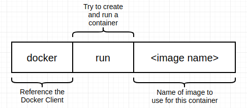
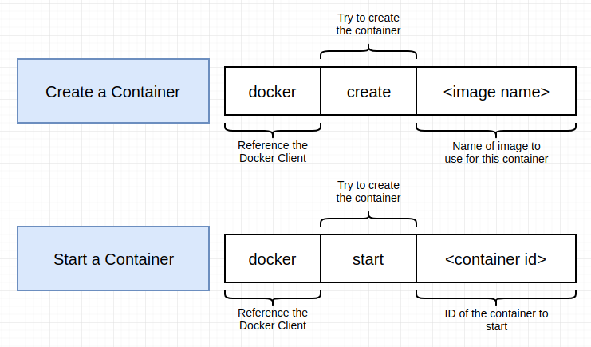
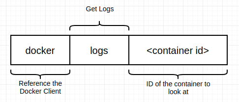
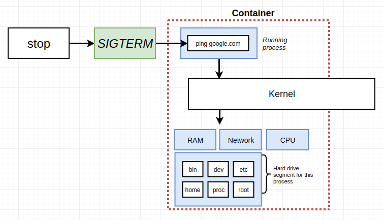
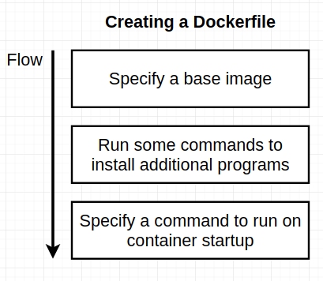
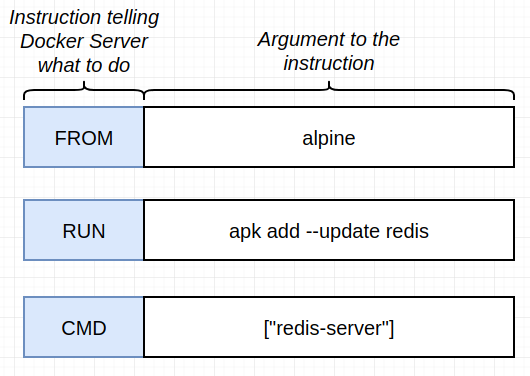
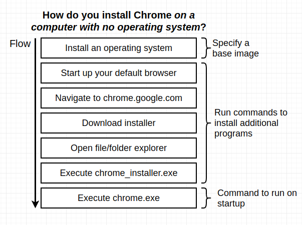
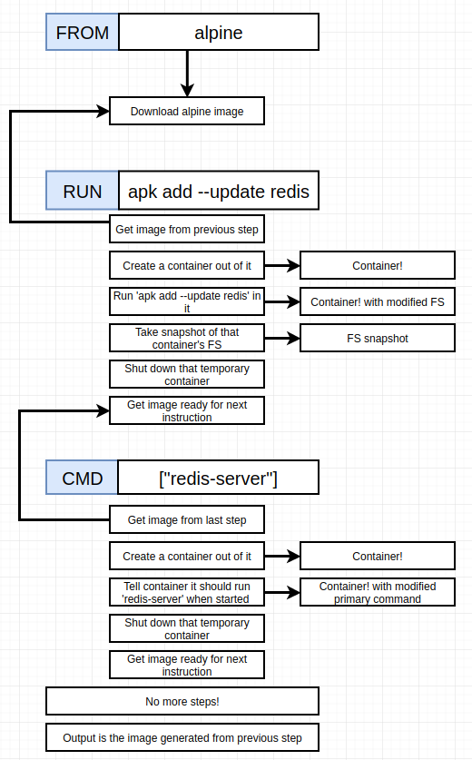
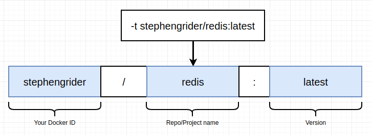

# Docker and Kubernetes: The Complete Guide Notes

This file contains all of the notes taken during the completion of the Docker and Kubernetes: The Complete Guide course by Stephen Grider on Udemy. The course can be found [here](https://www.udemy.com/course/docker-and-kubernetes-the-complete-guide/).

## Section 1: Dive Into Docker

* Docker is used to make installing and using software on a computer easier
* Docker is a platform or ecosystem around creating and running containers
* The Docker ecosystem consists of a few different things
  * Docker Client (also known as the Docker CLI)
    * Docker Client is the tool used to issue docker commands
  * Docker Server (also known as the Docker Daemon)
    * Docker Server is responsible for creating images, running containers, ect...
  * Docker Machine
  * Docker Images
    * A file system snapshot and a start command specifying how to start the process that will run in a container
  * Docker Hub
    * Docker Hub is a repository of free public images that one can freely download and run on a computer
  * Docker Compose
* An image consists of a single file containing all of the dependencies and configuration required to run a program
* A container is an instance of an image and runs a program
  * It is a program with its own isolated set of hardware resources
  
The below are the steps that occur after running `docker run hello-world`

1. The Docker Client is started and contacts the Docker Daemon.
2. The Docker Server sees that we are trying to start the hello-world image. Docker Server first checks if the hello-world image already exists on the computer by checking the image cache.
3. Because the image did not already exist in the image cache, Docker Server downloaded the image from Docker Hub into the image cache.
4. The Docker Daemon then created a new container from the downloaded image that runs an executable that produces the message seen in the terminal after executing the `docker run hello-world` command.
5. The Docker Daemon then streamed the output from the container to the Docker Client, which sent it to our terminal, resulting in the displaying of the message in the terminal.


* Operating systems have a kernel, which is a running process that governs between all of the programs running on a computer and the physical hardware resources available to the computer
  * ie. When writing a file to a hard drive using nodejs, nodejs informs the kernel that it wants to write to the hard drive and the kernel take the needed information and writes it to the hard drive for the nodejs process
* Programs interact with the kernel via system calls, which are requests to interact with a piece of hardware
* Namespacing: allows the isolation of resources per process (or group of processes)
  * The kernel can then look at what application is making a system call and use the correct segment of the hardware resource for that application
  * Not only used in hardware, but also software
* Control Groups (cgroupsl): allow the limiting of resources used per process

### So, what is a container?
* A container contains a running process that sends a system call to a kernel which directs the system call to a specific portion of hardware resources
* A portion of the systems hardware resources are made available to containers
* Containers are created from images, which are file system snapshots (which are essentially a copy/paste of a specific set of directories and/or files) and a start command informing how to start the process that will run in the container


## Section 2: Manipulating Containers with the Docker Client

### Docker run in detail



* After specifying the image name, we can supply a command to override the default run command of the container we are attempting to run
* The `docker run` command is identical to running the `docker create` and `docker start` commands together in that order



* `docker create` prepares an images file snapshot for use within a container
  * After running `docker create`, the id of the container create will be output for use with the `docker start` command
* `docker start` executes the run commands specified within an image
  * Using the `-a` flag will print out any output generated from running the container, not using the flag will result in the id of the container being output

### Listing Running Containers

* A list of running Docker containers can be displayed by running the `docker ps` command
* Running `docker ps --all` will display all containers that we have ever created, not just the ones that are currently running

### Restarting Containers

* To restart a stopped container, we can run the `docker start` command using the stopped containers id
  * When restarting a stopped container, the command used when originally starting the container will be used. This means that if an override command was used to originally start the container, that command will be the command that is used when restarting the container

### Removing Stopped Containers

* To remove stopped containers, we can run `docker system prune`, which will remove all stopped containers, all networks not used by at least one container, all dangling images and the build cache (downloaded images)

### Retrieving Log Outputs From Containers

* To get logs from a container we can use the `docker logs` command



### Stopping Running Containers

* To stop a running container, we can run the command `docker stop` or `docker kill`
* The following diagram lays out what occurs when the `docker stop` command is executed on a container



* Containers are stopped by issuing a SIGTERM or SIGKILL command (done automatically by `docker stop` or `docker kill` respectively)
  * SIGTERM is a command that can be issued to a docker container to stop the container and is issued upon running `docker stop`
    * It gives the process a little bit of time to shut itself down and perform any necessary cleanup
    * Many programming languages can listen for the SIGTERM command to be issued and perform any cleanup before ending execution
    * If a container fails to respond to a `docker stop` within 10 seconds, Docker will automatically run the `docker kill` command on the container
  * SIGKILL is another command that can be issued to a docker container to stop the container and is issued upon running `docker kill`
    * It tells the container to shut down immediately without any time to do any additional work/cleanup

### Multi-command Containers

* Commands can be issued within a docker container using `docker exec`


* The `-it` flag allows us to type input directly into the container
  * The `-i` flag attaches our terminal to the stdin process of the new running process (ie. bash, redis-cli)
  * The `-t` flag ensures that all of the text being input/output to the process are output in a nice format (the format we expect from running that process will not appear when not using the `-t` flag and only using the `-i` flag)
* Using the `docker exec` command with the `-it` flag, we can execute a shell within our container
  * For example, running `docker exec -it <container_id> bash` will give us access to a bash shell within our container
  * It is also possible to open a shell when starting a container (this will override the default command) by running `docker run -it <image_name> sh` (sh can be replaced with bash/zsh/etc... if available within that container)
    * Typically we will want to start our container using its default command and `docker exec` in a shell within our running container

## Section 3: Building Custom Images Through Docker Server

### Creating Docker Images

* To create a custom Docker image, we need to create a Dockerfile
  * A Dockerfile is a plain text file that has contains configuration specifying how our container will behave


* Inside of a Dockerfile, we need to specify a base image, commands to install additional programs and a command to run on container startup



* Below is an example of a Dockerfile that creates an image that runs redis-server

```Dockerfile
# Use an existing docker image as a base
FROM alpine

# Download and install a dependency
RUN apk add --update redis

# Tell the image what to do when it starts as a container
CMD ["redis-server"]
```

* The image specified by the above Dockerfile can then be built by navigating the the directory containing the Dockerfile and running `docker build .`



* The most important Dockerfile instructions to understand and know are `FROM`, `RUN`, and `CMD`
  * The `FROM` instruction specifies what image we want to use as a base for our custom image
  * The `RUN` instruction is used to execute some command while preparing our custom image
  * The `CMD` specifies what command to run when starting our container

### What's a Base Image?

* Writing a Dockerfile == Being given a computer with no OS and being told to install Chrome
* The flow of installing chrome when given a computer with no operating system can be related with writing a Dockerfile in the following way:



* The base image is the initial starting point for a Docker image

### The Build Process In Detail

* Below is a diagram outlining the steps that occur when running `docker build` on our Dockerfile



* When rebuilding docker images from dockerfiles, only the steps from the first changed line down will be run
  * This is because Docker caches the steps of building a docker container and uses previously build intermediate images when rebuilding docker images

### Tagging an Image

* Tagging an image allows us to run custom docker containers without the need of having the images id
  * Images can be tagged using the `-t` flag when running `docker build`
* The convention for tagging images is as follows:



* Thus, runnin the command `docker build -t trentgillis/redis:latest .` will allow us to run our container by using `docker run trentgillis/redis:latest` rather than using the images id
  * If we do not put a version at the end of our tag, latest will be used by default
  * Technically, the tag for an image is just the version with the other parts being just the Docker ID and the repository for that image
  
* It is also possible to create images from docker containers
  * ie. we can run a container manually and then create an image from that container
  * Images can be created from containers using the `docker commit` command
  * An example of the use of the `docker commit` command is as follows: `docker commit -c 'CMD ["redis-server"]' 4e5adc049458`
    * The `-c` flag allows us to specify the default command for the created image
    * The `4e5adc049458` argument passed to `docker commit` is the ID of the running container we want to create the image from